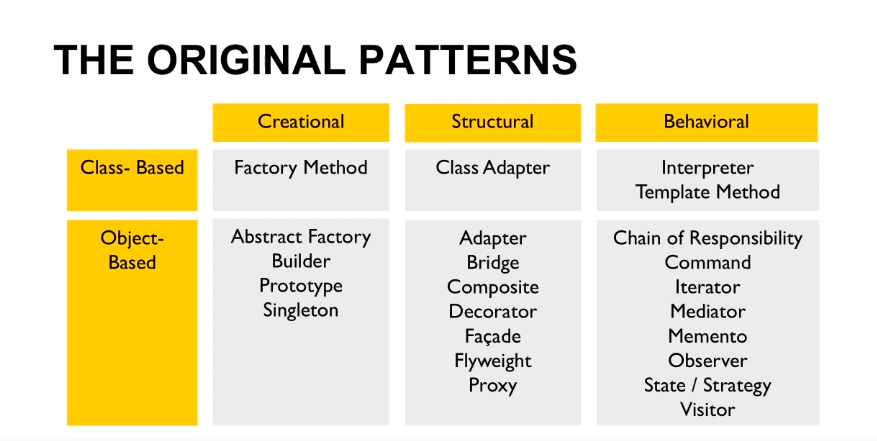

Modern C++ Design Patterns
==========================
Design patterns, Idioms, Functional programming techniques & key features of C++ 11, C++14

Design Patter is a tested solution to a recurring problem in a particular context, 
patterns are design ideas, one implemented patterns encode best practices -  
helps programmers to produce good code.

##### Advantages:
* Shared language, build on experience 
* Avoid common pitfalls, avoid reinventing the wheel

Christopher Alexander - 23 basic patterns ( The gang of four ) 

* Divided in three main groups:
* Creational: ways of creating objects
* Structural: how objects are build into lager structures
* Behavioral: relay on objects run time behavior

##### Patters
MVC - Model, View, Controller , basis of many UIs, decouple UI from logic

State - Represent changing object state, object states are classes, bank account 
		Context --> State
                     ^
			     ^        ^
			State A	   State B

Singleton - One instance of a type, depending on what does 'one' mean, lifetime issues, initialization, ( one instance per app ? ) 

Observer - notification of state changes, implemented in many frameworks 
		Observer -- register --> Object 
		Observer <-- notifies -- Object

Chain of Responsibility - Source of commands objects and a series of processing objects, promotes
the idea of loose coupling.

##### Idioms
Language or platform specific, idioms are code level, example: pointers and templates in c++, garbage collector in java 

###### C++ Idioms
RAII - Resource Acquisition Is Initialization

PIMPL - Pointer to implementation, decouple implementation from use, Improve compilation 

SMART Pointers - Provide a mechanism to manage resources, it overload ->, manage resources, provide proxies, Many uses in C++

CRTP - Curiously Recurring Template Pattern, static polymorphism, removes need for virtual func

##### Implementation
Implementing patterns and idioms  - how a patter is implemented 

RAII

	class Lock {
		Lock() { // do something }
		~Lock() { // undo something }
	};

STATE

	class Member {
	    // Interface used to represent a
	    // FreeTier, Basic, Premium Membership
		Membership* role;
	};

PIMPL

    class Container{
        Impl *_impl
        // ...
    };

    class Container::Impl {...};

SMART PTR

    class Ptr<T> {
        T* p;
    public:
        // ...
        T* operator->() const {
            return p;
        }
    };

CRTP

    class B<T> { };
    class D : public B<D> { };

Singletone

    class NaiveSingelton
    class DCLSingleton
    class MeyersSingleton

Chain of Responsibility

Modern C++ Features
===================

The Range Based For

Provides a clean mechanism to iterate through a collection

    auto arr = {1, 2, 3};
    for (auto i : arr) {
        std::cout << i;
    }

Smart Pointers

Used in preference to manually call NEW or DELETE

    # include <memory>
 
    std::unique_ptr<int>
        p1(new int(10))

    std::cout << *p1
        << std::endl

Lambdas

Anonymous functions, closures, shorter code, more readable code, much used by the STL

    std::sort (x.begin(), x.end(),
         {
            return (
                std::abs(a) < std::abs(b));
        }
    );

Move Semantics

R-valued references, make use of temporaries, reduce construction and copying of objects to
passing data

    Foo& operator=(Foo&& f)
    {
        p = f.p;
        f.p = nullptr;
        return *this;
    }

Function and Bind

Variadic Templates

Online Resources
isocpp.org/std/status
stroustrup.com/C++FAQ.html
cpprocks.com/
arne-mertz.de
en.cppreference.coml

Functional Programming
======================

Function execution, a style of programming, introduces new patters, supported by functional languages,
C++ makes functional programming easier, efficient for write algorithm & concurrency code

* Why not OO ?
    OO is not enough, not good at composing algorithms,
    OO data strutures are often slow, OO does not handle concurrency well.

#####Higher Order Functions
* Function as a data
* Pass them as arguments
* Return them as results
* Functions used as building blocks
* std::function & std::bind

Immutable data - once data created, it does not change, mutation may create a copy ( helps with concurrency, reasoning)

#####Higher Order Operators
* Filter - Select elements from a sequence using a predicate ( n%2 )
* Map - Apply an operation to each element, result in a new space ( n => n+2 )
* Reduce - Fold, combine elements into a single value (a,b) => a + b

#####Functional programming in C++
Use the STL and standard algorithms, use immutable data and pure functions
* std::remove_copy_if will do 'filter'
* std::transform does a 'map'
* std::accumulate for 'reduce'

Functional Error Handling
- do not throw exceptions
- always return a value
- Handle the exception when you want

        auto resutl = parse ("123")
        if ( result.is_valid()){
            std:.cout << result.get_value() << std::endl;
        }

Readings
    codereview.stackexchange.com
